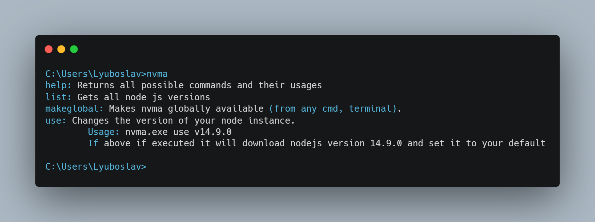
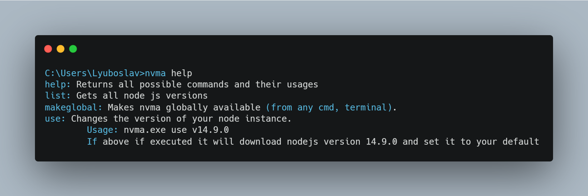
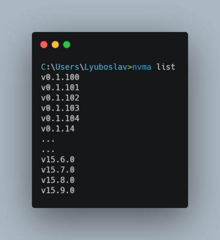
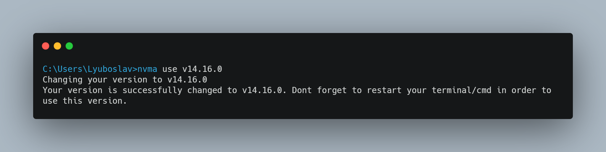
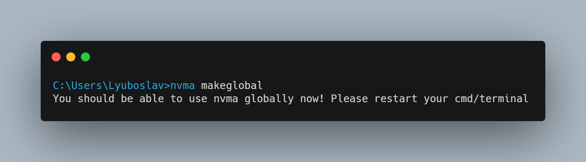

# NVMA



NVMA is a tool that "acts" like the https://github.com/coreybutler/nvm-windows, but without requiring admin rights for installing and using. 
It mimics only essential subset of features that are needed in order to get multiple versions of nodejs. 

## Prerequisites

You must uninstall nodejs, if you had it installed previously.

## How to install

Just download the binary and execute it from cmd

## Usage

### nvma help
To see all commands you need to execute either:
```
nvma help
```
or
```
nvma
```


### nvma list
To lists all nodejs version that you can use you need to use:
```
nvma list
```


### nvma use version
To change your version:
```
nvma.exe use <version>
nvma.exe use v14.9.0
```


After you changed your version, you need to restart your terminal/cmd in order to access your nodejs.

### nvma makeglobal

To make nvma use everywhere, not only in nvma folder, execute makeglobal command use:
```
nvma makeglobal
```

After that you again need to restart your terminal/cmd.
## Issues

Once you execute `nvma use` or `nvma makeglobal` you need to make sure that you dont move nvma to another folder. Moving to another folder results in nodejs not longer being recognized, also nvma wont work globally. 
To overcome this, you can use `nvma use` and `nvma makeglobal` again.

There arent any other issues that i'm aware of. If you have any problems, please open a issue.

## How it works?

`nvma` is taking far simpler approach than `nvm`. Its just modifying your environemnt variables. When you type `nvma use`, once selected nodejs has been selected, it will add current path to `PATH` variable, thus making it accessable globally.